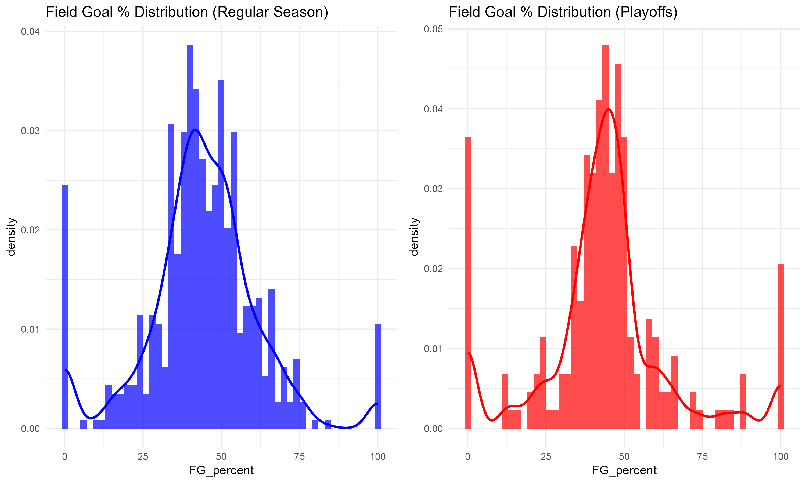
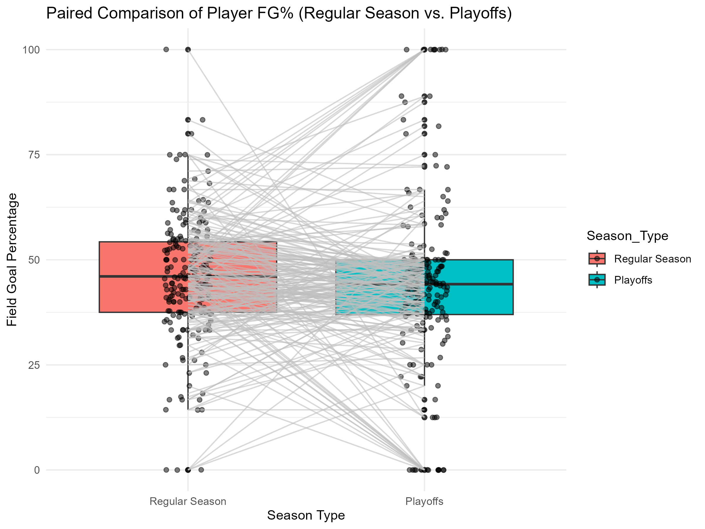
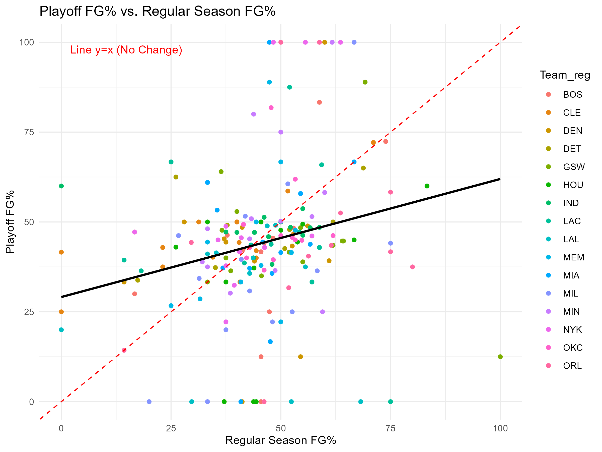
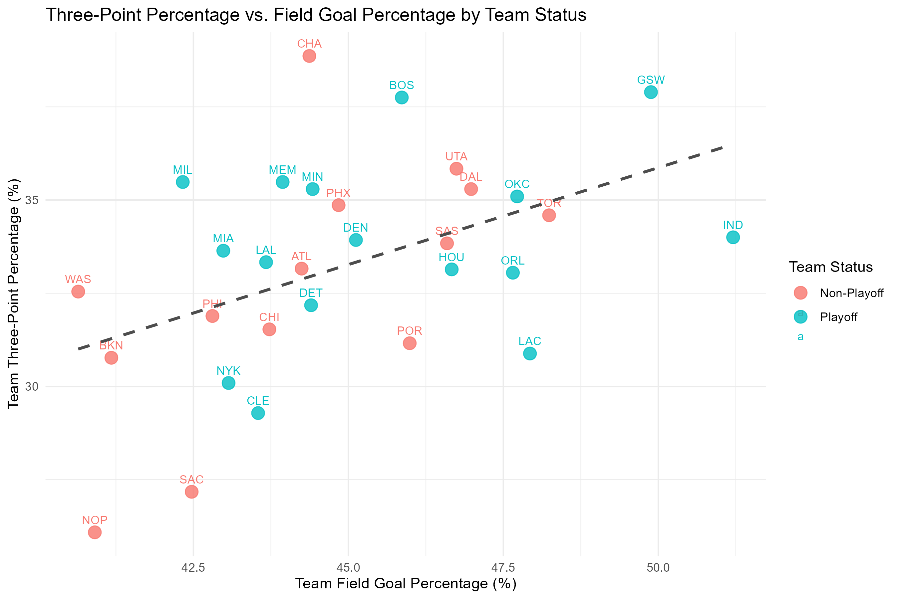

```{r setup, include=FALSE}
knitr::opts_chunk$set(echo = TRUE, warning=FALSE)
```

# Abstract
- This report examines whether NBA players’ shooting efficiency changes between the regular season and the playoffs. Using league-wide player-level data, we focus on field goal percentage and three-point percentage. We rely on a dedicated cleaning file to standardize variables and on a visualization file to produce distribution, paired comparison, and correlation plots. Preliminary visuals suggest modest declines in playoff efficiency. In the final phase, we will run paired tests and report effect sizes with confidence intervals.

# Introduction
- Playoffs often feature stronger defenses and higher pressure. These conditions may affect shooting outcomes. We ask whether field goal percentage and three point percentage differ between the two stages for the same players and whether regular season performance correlates with playoff performance.

# Data and Cleaning
- The datasets are Regular Season.csv and Playoffs.csv. Cleaning and variable standardization are performed in the separate R Markdown file 11_DataCleaning.Rmd.
- Step 1: Load the datasets. First, both the regular-season and playoff datasets were imported into the workspace. After loading them, we checked the structure of each dataset to understand what variables they included, how the data were formatted, and whether there were any immediate issues. This gave us a baseline understanding of the raw data before making any changes.
- Step 2: Keep only the relevant columns. Next, we reduced each dataset to just the variables needed for the analysis. This step removed extra or unnecessary columns so that the remaining datasets contained only the player identity, team, playing time, scoring totals, and shooting statistics we planned to work with.
- Step 3: Rename columns for consistency. Because the column names in the two datasets were not fully consistent, all selected variables were renamed to follow the same naming style. This standardization ensured that both datasets used identical labels, which is important for combining them later and for avoiding confusion during analysis.
- Step 4: Combine the datasets. Finally, the cleaned regular-season and playoff datasets were merged into a single dataset. A new variable was added to label each observation as either “Regular” or “Playoffs,” making it possible to compare player performance across the two contexts within one unified dataset.

# Visualization
- We include the visualization plots that visualize the distribution of shooting efficiency, paired boxplots for player-level performance comparison, and correlation scatter plots between regular and playoff FG%.

- Distribution of Shooting Efficiency: The first set of plots shows histograms of field-goal percentage for the regular season and the playoffs. These visualizations allow us to compare how player shooting efficiency is spread out in each setting. Both distributions are unimodal and generally bell shaped. The Playoffs distribution appears more concentrated around 50%, which implies that the sample of players who participate in the playoffs is slightly more consistent in FG%. Both plots show spikes around 0% and 100%, which can be explained by players taking one shot and missing it (0%), or making it (100%). 

\newpage
- Paired Comparison of Performance: Next, we created a paired boxplot using only players who appear in both datasets. This visualization places regular-season and playoff field-goal percentages side by side for the same individuals. From this paired boxplot, we can see that player FG% is mostly stable between the regular season and the playoffs, with almost no change in the median. However, many players experience slight increases or decreases in their shooting. 

\newpage
- Correlation of Performance. Next, we produced a scatterplot that compares each player’s regular-season field-goal percentage to their playoff field-goal percentage. Each point represents one player, showing both values together. From the scatter plot, we can conclude that a player's regular season FG% is a moderate predictor of their playoff FG%, which is shown by the positive correlation. However, the large scatter indicates that many players' efficiency changes a lot, which indicates a high level of variability in performance under pressure. 

\newpage
- Team Field Goal and Three Point Percentage Comparison. Next, we produced two paired boxplots comparing the distribution of field goal and three point percentage for Playoff teams (blue) versus Non-Playoff teams (red). Looking at the plots, we see that playoff teams generally have a slightly higher median FG% than Non-Playoff teams, but the performance distributions have a lot of overlap. However, Playoff teams show a more distinct advantage in three point percentage with a higher median and more consistent performance across the middle 50% of teams.

- Three-Point Percentage vs. Field Goal Percentage by Team Status. Finally, we created a scatterplot that shows the relationship between FG% (x-axis) and 3P% (y-axis) for all teams. The dashed line indicates a positive correlation between FG% and 3P%. Playoff teams tend to be clustered towards the upper right quadrant of the plot, indicating a higher FG% and 3P%. Non-playoff teams are scattered more broadly, but several are located in the lower left, indicating a lower FG% and 3P%. 

\newpage

# Statistical Analysis
- Step 1: Identify playoff teams. We first loaded the datasets, then extracted a list of all teams that appear in the playoff dataset. This allows us to distinguish which teams made the playoffs and which did not, which is necessary for comparing team shooting performance between the two groups.
- Step 2: Aggregate regular-season data to the team level. Player-level statistics were summed to produce team-level totals for field-goals made and attempted, as well as three-pointers made and attempted. From these totals, team field-goal percentage and three-point percentage were calculated. This aggregation converts individual player performance into overall team shooting efficiency.
- Step 3: Classify teams as Playoff or Non-Playoff. Each team was labeled based on whether it appeared in the playoffs. This classification created two groups: “Playoff” and “Non-Playoff”, for subsequent statistical comparisons. Only the relevant columns (team name, playoff status, and shooting percentages) were kept for clarity.
- Step 4: Organize data for comparison. We separated the shooting percentages into two groups for each metric: field goal percentage (FG%) and three point percentage (3P%). Each metric was split into values for playoff teams and non-playoff teams. This organization allows us to compare the average performance of playoff and non-playoff teams.
- Step 5: Conduct t-tests. Unpaired t-tests (Welch’s t-test, assuming unequal variances) were performed to determine whether differences in FG% and 3P% between playoff and non-playoff teams are statistically significant. This step provides formal evidence of whether playoff teams shoot more efficiently than non-playoff teams.
  - From the t-test comparing FG%, we get a t-statistic of 1.4963. This yields a p-value of 0.1458, which means that it is not statistically significant. 
  - From the t-test comparing 3P%, we get a t-statistic of 1.0121. This yields a p-value of 0.3218, which means that is is also not statistically significant. 
- Step 6: Compute Cohen's d. Cohen’s d was calculated for FG% and 3P% to measure the effect size of the difference between playoff and non-playoff teams. Cohen’s d quantifies how large the difference is in standard deviation units, giving context beyond just statistical significance.
  - The Cohen's d value for FG% was 0.545, which represents a medium effect size. This means that the average Playoff team's FG% is slightly more than half a standard deviation higher than the average Non-Playoff team's FG%. 
  - The Cohen's d value for 3P% was 0.369, which represents a small to medium effect size. The difference in 3P% between the two groups is present but less pronounced than the FG% difference, suggesting that the advantage in three point shooting is smaller compared to the variation in team 3P%. 
- Step 7: Summarize and save results. The results were summarized by printing the mean shooting percentages, t-test results, and Cohen’s d for each metric. Finally, the team-level data with shooting percentages and playoff status were saved to a CSV file for reporting or further analysis.

# Summary Statistics
- Group players by stage: We first organized the combined dataset by stage, separating players’ statistics into two groups: regular season and playoffs. This grouping allows us to compute summary statistics for each stage separately, rather than mixing all players together.
- Calculate summary statistics: For each group, we calculated the following: The total number of players included (players_n), the average field-goal percentage (FG_mean) and its standard deviation (FG_sd), the average three-point percentage (TP_mean) and its standard deviation (TP_sd), these measures provide a concise overview of shooting performance and variability for each stage.
- Display results in a table: Finally, the summary statistics were presented in a formatted table within the report. This table allows us to quickly compare overall shooting efficiency and variability between the regular season and playoffs, making it easy to see whether shooting tends to improve, decline, or remain consistent across stages.

# Conclusion
- From our project, we have discovered many things. The pressure of being in the playoffs is insanely heavy, getting to even the most seasoned of players. This is shown through our analyses, seeing that players tend to have a lower upper quartile in the playoffs compared to during the regular season. We also observe the importance of field goal and three point efficiency for getting into the playoffs in the first place. Field goal percentage seems to be more important than three point percentage for making the playoffs, as shown by the Cohen's d value. The plots we included in our report help to visualize the impacts of each variable. 
- In the future, I would like to continue to explore the many factors that lead to a team making the playoffs, including other variables such as free throws and injuries. There are many other factors to account for in such a complex game. 

# GitHub Link
https://github.com/NeilTChen/STAT107_Final_Project_Group_20

# Team Contributions
- Seonghee Seo: Contributed to the 00_requirements.R and 11_DataCleaning.Rmd files, the report submitted for the Half-Way Project Evaluation, and the final README file. Also reviewed the project files for typos and wording issues and made corrections where needed.


- Neil Chen: Wrote the 02_funct_Plots.R, 31_DataVisualization.Rmd, and 41_Statistical_Analysis.Rmd files, the report submitted for the Half-Way Project Evaluation, and gathering the data for the project. I also contributed to the final report. 

- Allen Weng: Contributed to the final report and interpreted the data. Suggested the topic for the project. Also made corrections where needed and consistently updating the files.
